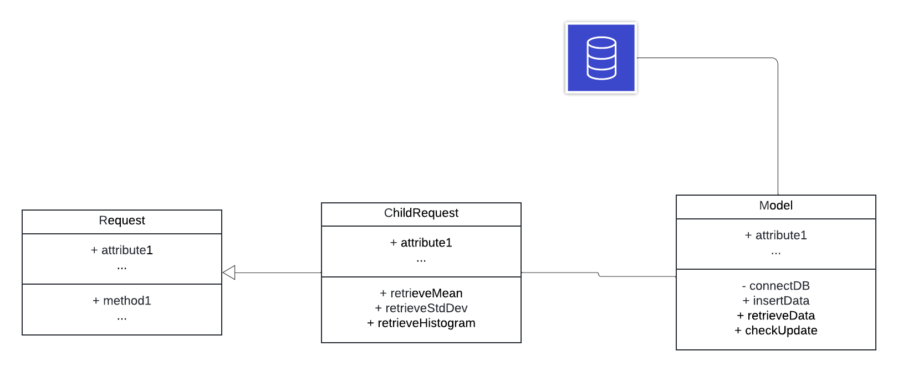
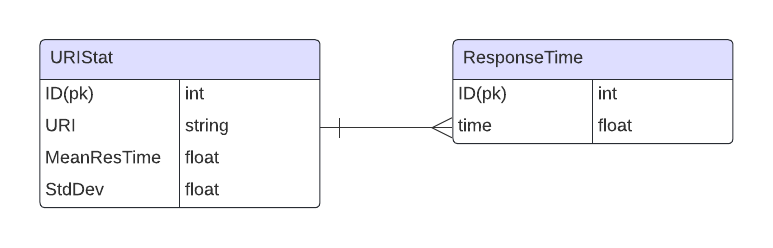

# RequestChild
GoodMorning.com candidate exercise

## Tech Stack

## UML Class Diagram

PHP 8.1.2-1ubuntu2.14 (cli)

php GD

PhpUnit 9.5.10

## References
[time efficiency compare between array_map and forech loop](https://stackoverflow.com/questions/25481714/php-is-array-map-faster-than-foreach)

[for vs foreach time efficiency](https://stackoverflow.com/questions/3430194/performance-of-for-vs-foreach-in-php)

[Tracking the script execution time in PHP](https://www.php.net/manual/en/function.microtime.php)

[Graphing Histogram using PHP GD library](https://stackoverflow.com/questions/645582/how-to-draw-a-graph-in-php)

[PhpUnit tutorial](https://linux.how2shout.com/3-ways-to-install-phpunit-in-ubuntu-22-04-or-20-04-lts/)

[PhpUnit gitignore](https://github.com/sebastianbergmann/phpunit/blob/main/.gitignore)

[Stand_Deviation function to test retrieveStdDev](https://www.geeksforgeeks.org/php-program-find-standard-deviation-array/)

## Testing command
phpunit ChildRequestTest.php

## To use and see example of histogram
php -S localhost:5500 -t .

## Message to the judging team:
Thank you again for giving me this chance to showcase myself. Despite that I wanted to give you guys a better solution, I figured I shouldn't keep you waiting too long.
However, I do have a brief design sketch that could potentially improve the time efficiency and overall useability. 

### Further Design UML Class Diagram:

### DataBase Design:

I hope you like me solution and I assure you I will do better as part of your team, if you give me a chance, I won't let you down. 

Sincerely,

Ziang Li.